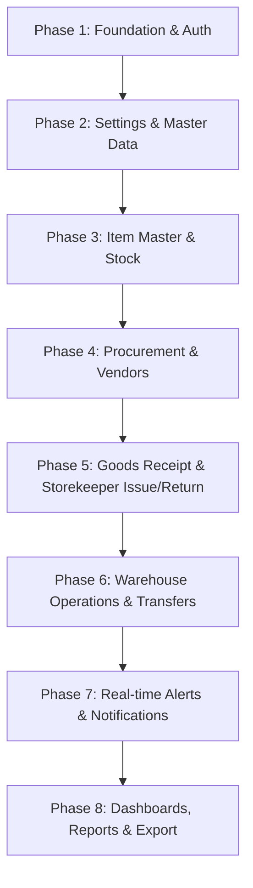

# IIMS Project Phases & Development Roadmap
## Industrial Inventory Management System (IIMS)

This document breaks down the development of the Industrial Inventory Management System into structured, sequential, implementation-ready phases. It reflects a split-stack architecture consisting of:
1. **Backend API Server (Express + TypeScript + Mongoose)**
2. **Frontend Web App (Next.js 14 App Router + Tailwind CSS + ShadCN UI)**

Each phase targets specific modules, defines core deliverables, lists files to be created/modified in both repositories, and provides verification criteria.

---

## Roadmap Overview

---

## Phase 1: Scaffold, DB Connection & Authentication
**Focus:** Setup DB connection pool in the Backend API server, scaffold the Frontend Next.js 14 client, establish NextAuth.js v5 credentials flow, and enforce RBAC routing blocker.

### 📋 Key Deliverables
- Scaffolded Express backend (`backend`) with dev watcher and base configurations.
- Scaffolded Next.js client (`frontend`) with tailwind.config.ts, tsconfig, etc.
- MongoDB connection config on backend.
- RBAC Permission helper matrix on both backend and frontend.
- NextAuth.js Credentials provider integrated on frontend with server-side API auth validation.
- Database seed script for default admin credentials.

### 📂 Files to Create/Modify

#### 🖥️ Backend (Express API)
- [NEW] `backend/package.json` / `tsconfig.json`
- [NEW] `backend/src/server.ts` — Server entry point mounting core routers
- [NEW] `backend/src/config/db.ts` — MongoDB connection pooling
- [NEW] `backend/src/models/User.model.ts` — User schema, roles, preferences
- [NEW] `backend/src/routes/auth.routes.ts` — Auth controllers (login/register)
- [NEW] `backend/scripts/seed.ts` — Admin credentials database seeding

#### 🎨 Frontend (Next.js Client)
- [NEW] `frontend/package.json` / `tailwind.config.ts` / `tsconfig.json`
- [NEW] `frontend/src/lib/auth/config.ts` — NextAuth handler routing credentials verification to Backend API
- [NEW] `frontend/src/lib/auth/permissions.ts` — RBAC checks (`hasPermission`)
- [NEW] `frontend/src/middleware.ts` — Global route blocker restricting dashboard routes
- [NEW] `frontend/src/app/(auth)/login/page.tsx` — Login interface
- [NEW] `frontend/src/app/(auth)/layout.tsx` — Auth pages wrapper layout
- [NEW] `frontend/src/components/auth/LoginForm.tsx` — Login form component
- [NEW] `frontend/src/components/auth/ProtectedRoute.tsx` — Client-side RBAC guard UI wrapper

---

## Phase 2: Organization Settings & Master Tables
**Focus:** Define administrative metadata, category taxonomies (supporting custom dynamic attributes), units of measurement, and auto-number counter systems.

### 📋 Key Deliverables
- Backend CRUD endpoints for dynamic category trees (supporting dynamic custom attributes per category).
- UoM configurations with unit conversion factor logic.
- Atomic counters for automated transaction naming (`ITM-`, `PO-`, `GRN-`, `IV-`, `TRF-`, `MOV-`, `VND-`, `WH-`, `RTN-`).
- Organization profile data configuration (GSTIN, Logo, Addresses).

### 📂 Files to Create/Modify

#### 🖥️ Backend (Express API)
- [NEW] `backend/src/models/Setting.model.ts` & `Counter.model.ts`
- [NEW] `backend/src/models/Category.model.ts` & `Unit.model.ts`
- [NEW] `backend/src/models/Organization.model.ts`
- [NEW] `backend/src/routes/category.routes.ts` — CRUD for category hierarchies
- [NEW] `backend/src/routes/unit.routes.ts` — CRUD for Units of Measurement
- [NEW] `backend/src/routes/setting.routes.ts` — Org info and counter sequence management

#### 🎨 Frontend (Next.js Client)
- [NEW] `frontend/src/app/(dashboard)/settings/page.tsx` — Redirect handler
- [NEW] `frontend/src/app/(dashboard)/settings/layout.tsx` — Settings sidebar layout
- [NEW] `frontend/src/app/(dashboard)/settings/organization/page.tsx` — Org profile edit screen
- [NEW] `frontend/src/app/(dashboard)/settings/users/page.tsx` — User management console (add/edit drawers)
- [NEW] `frontend/src/app/(dashboard)/settings/categories/page.tsx` — Hierarchy tree manager page
- [NEW] `frontend/src/app/(dashboard)/settings/units/page.tsx` — Units conversion setting page
- [NEW] `frontend/src/app/(dashboard)/settings/numbering/page.tsx` — Counter prefix/digits configuration page
- [NEW] `frontend/src/components/settings/SettingsSidebar.tsx` — Settings sidebar navigation
- [NEW] `frontend/src/components/settings/OrganizationForm.tsx` — Form for company info
- [NEW] `frontend/src/components/settings/CategoryTree.tsx` — Interactive category tree view
- [NEW] `frontend/src/components/settings/CategoryForm.tsx` — Category creation/edit form (with attributes creator)
- [NEW] `frontend/src/components/settings/UnitForm.tsx` — UoM setup form
- [NEW] `frontend/src/components/settings/NumberingConfig.tsx` — Prefix/sequences manager form

---

## Phase 3: Item Master & Initial Stock Configuration
**Focus:** Implement the central product repository (Item Master) supporting multiple warehouses, custom properties, and barcode records.

### 📋 Key Deliverables
- Item CRUD APIs and forms rendering dynamic fields based on selected category custom attributes.
- Association tables tracking available, reserved, transit, and on-hand quantities across warehouses.
- Mass CSV/Excel import endpoints for fast item onboarding.

### 📂 Files to Create/Modify

#### 🖥️ Backend (Express API)
- [NEW] `backend/src/models/Item.model.ts` — Item master schema
- [NEW] `backend/src/models/Stock.model.ts` — Real-time warehouse-specific stock levels
- [NEW] `backend/src/routes/item.routes.ts` — CRUD, bulk import, stock levels endpoints
- [NEW] `backend/src/services/inventory.service.ts` — SKU generator, search, import logic

#### 🎨 Frontend (Next.js Client)
- [NEW] `frontend/src/lib/validations/item.schema.ts` — Client-side Zod validation
- [NEW] `frontend/src/app/(dashboard)/inventory/page.tsx` — Dense tabular item search page
- [NEW] `frontend/src/app/(dashboard)/inventory/new/page.tsx` — Wizard-form component to add items
- [NEW] `frontend/src/app/(dashboard)/inventory/[id]/page.tsx` — Item details (with stock levels, PO, movement tabs)
- [NEW] `frontend/src/components/inventory/ItemsTable.tsx` — Paginated items list
- [NEW] `frontend/src/components/inventory/ItemForm.tsx` — Reusable item form rendering category attributes
- [NEW] `frontend/src/components/inventory/ItemDetailDrawer.tsx` — Quick-view sidebar panel
- [NEW] `frontend/src/components/inventory/StockByWarehouse.tsx` — Table of stock counts per warehouse
- [NEW] `frontend/src/components/inventory/StockHistoryTable.tsx` — Table of stock movements list

---

## Phase 4: Vendor & Purchase Order (PO) Management
**Focus:** Build supplier onboarding records and coordinate purchase transactions through automated order configurations and verification systems.

### 📋 Key Deliverables
- Vendor onboarding database with contact, GSTIN, PAN, and banking details.
- Purchase Order Wizard (multi-item dynamic line entries, auto-totals, discount/GST calculation).
- Status workflow progression states (`draft` -> `sent` -> `partial` -> `received` -> `cancelled` -> `closed`).
- Auto-PO generator engine mapping low stock warnings to vendor specifications.

### 📂 Files to Create/Modify

#### 🖥️ Backend (Express API)
- [NEW] `backend/src/models/Vendor.model.ts` — Supplier schema
- [NEW] `backend/src/models/PurchaseOrder.model.ts` — PO transactions schema
- [NEW] `backend/src/routes/vendor.routes.ts` — Vendor CRUD and performance endpoints
- [NEW] `backend/src/routes/po.routes.ts` — PO actions, send/approve workflows
- [NEW] `backend/src/services/vendor.service.ts` & `po.service.ts` — Procurement calculations

#### 🎨 Frontend (Next.js Client)
- [NEW] `frontend/src/lib/validations/po.schema.ts` & `vendor.schema.ts` — Zod validators
- [NEW] `frontend/src/app/(dashboard)/vendors/page.tsx` & `[id]/page.tsx` — Vendor lists and details pages
- [NEW] `frontend/src/app/(dashboard)/purchase-orders/page.tsx` & `new/page.tsx` & `[id]/page.tsx` — PO pages
- [NEW] `frontend/src/components/purchase/VendorsTable.tsx` — Paginated vendors list
- [NEW] `frontend/src/components/purchase/VendorForm.tsx` — Add/edit vendor modal
- [NEW] `frontend/src/components/purchase/VendorDetailDrawer.tsx` — Side panel showing vendor details
- [NEW] `frontend/src/components/purchase/POTable.tsx` — Purchase orders list
- [NEW] `frontend/src/components/purchase/POForm.tsx` — Multi-step PO wizard form
- [NEW] `frontend/src/components/purchase/POLineItems.tsx` — Dynamic PO items line editor
- [NEW] `frontend/src/components/purchase/POStatusTimeline.tsx` — Visual tracking stepper
- [NEW] `frontend/src/components/purchase/POApprovalBar.tsx` — Action bar for manager approval

---

## Phase 5: Goods Receipt Notes (GRN) & Storekeeper Issue/Return Flow
**Focus:** Implement the physical inventory movements logic — Goods Receipt Notes (GRN) matching incoming items with PO contracts, and the Storekeeper-led slip-based material issuance and returns system.

### 📋 Key Deliverables
- GRN matching wizard validating PO line item counts, discrepancy highlights, and quality rejection logs.
- Confirmation logic: Updates stock balance, updates average costs, creates immutable movements log, generates batches/serial numbers.
- Storekeeper material issue voucher workflow with offline approval tracking (slip-based) and department dropdowns.
- Material return workflow against original issue vouchers tracking items' condition.

### 📂 Files to Create/Modify

#### 🖥️ Backend (Express API)
- [NEW] `backend/src/models/GRN.model.ts` — Stock inbound receipts schema
- [NEW] `backend/src/models/IssueVoucher.model.ts` — Modified issue schema supporting requester & approver details
- [NEW] `backend/src/models/ItemReturn.model.ts` — Material returns schema
- [NEW] `backend/src/models/Department.model.ts` — Department lookup schema
- [NEW] `backend/src/models/StockMovement.model.ts` — Audit log of all moves
- [NEW] `backend/src/models/Batch.model.ts` & `SerialNumber.model.ts` — Traceability records
- [NEW] `backend/src/routes/grn.routes.ts` — GRN create, update, confirm
- [NEW] `backend/src/routes/issue.routes.ts` — Storekeeper issue vouchers creation/list
- [NEW] `backend/src/routes/return.routes.ts` — Returns intake and stock return logs
- [NEW] `backend/src/services/grn.service.ts` — GRN confirmation and average cost update logic
- [NEW] `backend/src/services/issue.service.ts` & `return.service.ts` — Stock deduction/re-addition, batch tracking

#### 🎨 Frontend (Next.js Client)
- [NEW] `frontend/src/app/(dashboard)/inventory/grn/page.tsx` & `[id]/page.tsx` — Inbound receipt list & forms
- [NEW] `frontend/src/app/(dashboard)/storekeeper/page.tsx` — Storekeeper workspace dashboard
- [NEW] `frontend/src/app/(dashboard)/storekeeper/issue/page.tsx` & `new/page.tsx` & `[id]/page.tsx` — Material issues
- [NEW] `frontend/src/app/(dashboard)/storekeeper/returns/page.tsx` & `[id]/page.tsx` — Material returns
- [NEW] `frontend/src/components/inventory/GRNForm.tsx` & `GRNLineItems.tsx` — Goods receipt forms
- [NEW] `frontend/src/components/storekeeper/StorekeeperDashboard.tsx` — Actionable metrics for storekeepers
- [NEW] `frontend/src/components/storekeeper/IssueVoucherForm.tsx` — Helper issue form
- [NEW] `frontend/src/components/storekeeper/IssueVoucherDetail.tsx` & `PrintableVoucher.tsx` — printable material issue voucher layout
- [NEW] `frontend/src/components/storekeeper/IssueVoucherTable.tsx` — List of issue transactions
- [NEW] `frontend/src/components/storekeeper/ReturnForm.tsx` & `ReturnTable.tsx` — Return entries
- [NEW] `frontend/src/components/storekeeper/RequesterFields.tsx` — Reusable requester details block
- [NEW] `frontend/src/components/inventory/BarcodeScanner.tsx` — Barcode inputs (ZXing webcam/HID support)

---

## Phase 6: Warehouse Operations & Stock Transfers
**Focus:** Model multi-warehouse structures, zones, and bins. Build inter-warehouse stock transfer routing and physical stock reconciliation utilities.

### 📋 Key Deliverables
- Interactive layout manager to add zones, rows, and bins to warehouse nodes.
- Inter-warehouse transfer wizard tracking dispatched items (marking source stock as `in_transit`) and receiving workflows.
- Physical Stock Count audits logging variances, approvals, and adjustment correction entries.

### 📂 Files to Create/Modify

#### 🖥️ Backend (Express API)
- [NEW] `backend/src/models/Warehouse.model.ts` — Modified schema (manager, zones, rows, columns)
- [NEW] `backend/src/models/Transfer.model.ts` — Warehouse transfer schema
- [NEW] `backend/src/models/StockCount.model.ts` — Physical stock reconciliation schema
- [NEW] `backend/src/routes/warehouse.routes.ts` — Warehouse list and zone configurations
- [NEW] `backend/src/routes/transfer.routes.ts` — Transfer dispatch/receive workflows
- [NEW] `backend/src/services/warehouse.service.ts` & `transfer.service.ts`

#### 🎨 Frontend (Next.js Client)
- [NEW] `frontend/src/app/(dashboard)/warehouses/page.tsx` & `[id]/page.tsx` & `[id]/zones/page.tsx` — Warehouse maps
- [NEW] `frontend/src/app/(dashboard)/transfers/page.tsx` & `new/page.tsx` & `[id]/page.tsx` — Stock transfer flows
- [NEW] `frontend/src/components/warehouse/WarehouseCard.tsx` & `WarehouseForm.tsx`
- [NEW] `frontend/src/components/warehouse/ZoneManager.tsx` & `BinLocator.tsx` — Zone visual configurations
- [NEW] `frontend/src/components/warehouse/TransferForm.tsx` & `TransferLineItems.tsx` — Stock movement form
- [NEW] `frontend/src/components/warehouse/TransferStatusBar.tsx` — Lifecycle tracking bar
- [NEW] `frontend/src/components/warehouse/StockCountForm.tsx` — Auditing sheet component

---

## Phase 7: Real-time Alerts & Notification Workers
**Focus:** Connect real-time communications for critical inventory alerts, low-stock restocks, overdue order logs, and delayed deliveries.

### 📋 Key Deliverables
- Centralized `alerts` collection logging alert types (`low_stock`, `expiry_warning`, `po_overdue`, etc.).
- Socket.io configuration syncing server updates to client UI dashboards in real time.
- BullMQ worker integration managing background schedules (hourly PO overdue scans, daily batch expiry checks).
- Email templates (using Resend or Nodemailer) triggered on critical occurrences.

### 📂 Files to Create/Modify

#### 🖥️ Backend (Express API)
- [NEW] `backend/src/models/Alert.model.ts` — Alerts schema
- [NEW] `backend/src/socket/server.ts` — Socket.io server instance and rooms mapping
- [NEW] `backend/src/queue/workers.ts` & `backend/src/queue/jobs/check-po-overdue.ts` — Background jobs scheduler
- [NEW] `backend/src/services/alert.service.ts` & `notification.service.ts` — Email triggers and alert creation

#### 🎨 Frontend (Next.js Client)
- [NEW] `frontend/src/app/(dashboard)/alerts/page.tsx` — Full notification dashboard
- [NEW] `frontend/src/lib/socket/client.ts` — Client-side socket listener hooks
- [NEW] `frontend/src/components/alerts/AlertCenter.tsx` — UI for alerts listings
- [NEW] `frontend/src/components/alerts/AlertBell.tsx` — Nav header bell dropdown with unread badge count
- [NEW] `frontend/src/components/alerts/AlertPanel.tsx` — Sidebar mini-notifications panel
- [NEW] `frontend/src/components/alerts/AlertCard.tsx` & `AlertBadge.tsx` — Alert item layout cards

---

## Phase 8: Dashboards, Reports & Document Export
**Focus:** Implement analytics dashboards with Recharts, compile the 16 system reports (including the new Department-wise Consumption report), and deploy PDF/Excel export modules.

### 📋 Key Deliverables
- Main dashboard containing live charts, low stock tickers, and pending action panels.
- Aggregated endpoints for Stock Valuation, Aging reports, and ABC valuation models.
- PDF Generator (`@react-pdf/renderer`) streaming invoice-style PO or GRN documents.
- Excel exporter (`exceljs`) generating styled spreadsheet sheets.

### 📂 Files to Create/Modify

#### 🖥️ Backend (Express API)
- [NEW] `backend/src/services/reports.service.ts` — MongoDB aggregates for Aging, ABC, valuation reports
- [NEW] `backend/src/services/export.service.ts` — ExcelJS spreadsheet generator
- [NEW] `backend/src/routes/report.routes.ts` — Analytical data source routes
- [NEW] `backend/src/routes/pdf.routes.ts` — Streams PDF invoice-style forms

#### 🎨 Frontend (Next.js Client)
- [NEW] `frontend/src/app/(dashboard)/page.tsx` — Main KPI dashboard
- [NEW] `frontend/src/app/(dashboard)/reports/page.tsx` — Analytical report directory selector
- [NEW] `frontend/src/app/(dashboard)/reports/stock-status/page.tsx` — Status report viewer
- [NEW] `frontend/src/app/(dashboard)/reports/valuation/page.tsx` — Valuation report viewer
- [NEW] `frontend/src/app/(dashboard)/reports/movements/page.tsx` — Audit trail report page
- [NEW] `frontend/src/app/(dashboard)/reports/aging/page.tsx` — Aging report viewer
- [NEW] `frontend/src/app/(dashboard)/reports/abc-analysis/page.tsx` — ABC analysis graph page
- [NEW] `frontend/src/app/(dashboard)/reports/purchase/page.tsx` — Purchase order history page
- [NEW] `frontend/src/app/(dashboard)/reports/vendor-performance/page.tsx` — Supplier metrics details page
- [NEW] `frontend/src/app/(dashboard)/reports/expiry/page.tsx` — Expiry alarms checklist page
- [NEW] `frontend/src/app/(dashboard)/reports/department-consumption/page.tsx` — Department consumption metrics report
- [NEW] `frontend/src/components/reports/ReportSidebar.tsx` & `ReportFilters.tsx` — Layout filters block
- [NEW] `frontend/src/components/reports/ReportTable.tsx` & `ExportButton.tsx` — Data visualization grid
- [NEW] `frontend/src/components/reports/ReportChart.tsx` — Dynamically rendered charts
- [NEW] `frontend/src/components/reports/charts/StockTrendChart.tsx` — AreaChart for stock value
- [NEW] `frontend/src/components/reports/charts/ABCDonutChart.tsx` — PieChart for ABC classes
- [NEW] `frontend/src/components/reports/charts/MovementBarChart.tsx` — BarChart of daily moves
- [NEW] `frontend/src/components/reports/charts/VendorScoreChart.tsx` — RadarChart for vendor KPIs
